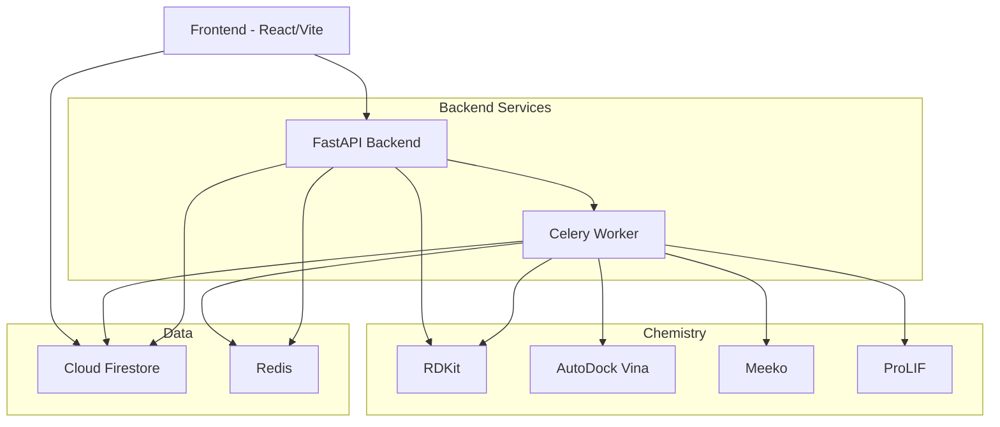

# ChemBind

Full-stack cheminformatics platform for molecular analysis, similarity search, conformer generation, molecular docking, and collaborative annotations.

## Architecture



## Features

| Feature | Status | Tier |
|---------|--------|------|
| Single SMILES analysis | Live | All |
| Batch CSV processing | Live | All |
| Morgan fingerprint persistence | Live | All |
| Similarity search (Tanimoto) | Live | All |
| Substructure search (SMARTS) | Live | All |
| Conformer ensemble (ETKDGv3+MMFF) | Live | All |
| Molecular docking (Vina) | Live | Enterprise |
| Protein-ligand interactions (ProLIF) | Live | Enterprise |
| Export (MOL/SDF/CDXML) | Live | Professional+ |
| Collaborative annotations | Live | Team+ |
| Share links (public view) | Live | Team+ |
| NGL 3D Viewer | Live | All |
| Batch gallery with thumbnails | Live | All |
| Feature flags + tier gating | Live | — |
| Rate limiting | Live | — |
| OWASP security headers | Live | — |

## Quick Start

### Prerequisites
- Docker & Docker Compose
- Firebase project with Firestore + Auth enabled
- Redis (local or Upstash)

### Local Development

```bash
# 1. Clone and setup
git clone <repo-url>
cd chembind

# 2. Backend
cd backend
cp .env.example .env  # Fill in Firebase credentials, Redis URL
conda env create -f environment.yml
conda activate chembind
pip install -r requirements.txt

# 3. Start services
docker compose up -d redis
bash dev.sh

# 4. Frontend
cd ../frontend
cp .env.example .env  # Set VITE_API_BASE, Firebase config
npm install
npm run dev
```

### Docker Compose (full stack)

```bash
docker compose up --build
```

## API Reference

### Core
| Method | Endpoint | Auth | Tier | Rate Limit | Description |
|--------|----------|------|------|------------|-------------|
| GET | `/api/health` | No | — | — | Health check |
| POST | `/api/analyze` | Optional | — | 60/min | Analyze SMILES |
| POST | `/api/batch` | Required | — | 60/min | Submit batch job |
| GET | `/api/jobs/{id}` | Required | — | 60/min | Job status |
| GET | `/api/jobs/{id}/items` | Required | — | 60/min | Job items |
| GET | `/api/me` | Required | — | — | Current user |

### Search
| Method | Endpoint | Auth | Tier | Rate Limit | Description |
|--------|----------|------|------|------------|-------------|
| POST | `/api/similarity/search` | Required | — | 60/min | Tanimoto similarity |
| POST | `/api/search` | Required | — | 60/min | Unified search |

### Conformers
| Method | Endpoint | Auth | Tier | Rate Limit | Description |
|--------|----------|------|------|------------|-------------|
| POST | `/api/conformers` | Required | — | 60/min | Generate conformers |

### Docking
| Method | Endpoint | Auth | Tier | Rate Limit | Description |
|--------|----------|------|------|------------|-------------|
| POST | `/api/docking/jobs` | Required | Enterprise | 60/min | Submit docking job |
| GET | `/api/docking/jobs/{id}` | Required | Enterprise | 60/min | Job status |
| GET | `/api/docking/jobs/{id}/poses` | Required | Enterprise | 60/min | Get poses |

### Export
| Method | Endpoint | Auth | Tier | Rate Limit | Description |
|--------|----------|------|------|------------|-------------|
| GET | `/api/export` | Required | Professional+ | 60/min | Export molecule |

### Annotations
| Method | Endpoint | Auth | Tier | Rate Limit | Description |
|--------|----------|------|------|------------|-------------|
| POST | `/api/annotations` | Required | Team+ | 60/min | Create annotation |
| GET | `/api/annotations` | Required | Team+ | 60/min | List annotations |
| PUT | `/api/annotations/{id}` | Required | Team+ | 60/min | Update annotation |
| POST | `/api/annotations/{id}/share` | Required | Team+ | 60/min | Share annotation |
| GET | `/api/shared/{id}` | No | — | — | Public view |

## Environment Variables

### Backend (.env.example)

| Variable | Required | Default | Description |
|----------|----------|---------|-------------|
| `REDIS_URL` | Yes | `redis://localhost:6379/0` | Redis connection |
| `FIREBASE_SERVICE_ACCOUNT_JSON` | Yes* | — | Firebase SA JSON |
| `GOOGLE_APPLICATION_CREDENTIALS` | Yes* | — | Path to SA file |
| `CORS_ORIGINS` | Prod | — | Comma-separated origins |
| `TRUSTED_HOSTS` | Prod | `localhost,127.0.0.1` | Allowed hosts |
| `SENTRY_DSN` | No | — | Sentry error tracking |
| `ENABLE_SIMILARITY_SEARCH` | No | `false` | Feature flag |
| `ENABLE_CONFORMERS` | No | `false` | Feature flag |
| `ENABLE_DOCKING` | No | `false` | Feature flag |
| `ENABLE_EXPORT` | No | `false` | Feature flag |
| `ENABLE_ANNOTATIONS` | No | `false` | Feature flag |
| `MAX_BATCH_ROWS` | No | `500` | Max CSV rows |
| `MAX_PDB_UPLOAD_BYTES` | No | `10485760` | Max PDB file size |

### Frontend (.env.example)

| Variable | Required | Description |
|----------|----------|-------------|
| `VITE_API_BASE` | Yes | Backend URL |
| `VITE_FIREBASE_API_KEY` | Yes | Firebase Web API key |
| `VITE_FIREBASE_AUTH_DOMAIN` | Yes | Firebase Auth domain |
| `VITE_FIREBASE_PROJECT_ID` | Yes | Firebase project ID |
| `VITE_FIREBASE_APP_ID` | Yes | Firebase app ID |

## Deployment

See [DEPLOY.md](DEPLOY.md) for detailed deployment instructions.
See [DEPLOY_ROADMAP.md](DEPLOY_ROADMAP.md) for feature deployment checklist.

## License

Private — All rights reserved.
